# PES-VCS Lab Report

**Name:** ABHAY S.
**SRN:** PES1UG24CS013
**Platform:** Ubuntu 24.04

---

# Phase 1 — Object Storage Foundation

**Files Modified:** `object.c`

`object_write()` prepends a header of the form:

```text
<type> <size>\0
```

to the object data, hashes the entire object using SHA-256, skips writing if the object already exists (deduplication), creates the shard directory, writes to a temporary file, calls `fsync()`, and atomically renames the file.

`object_read()` re-verifies the SHA-256 hash after reading the object, parses the object type and size from the header, validates that the declared size matches the actual size, and returns the data portion in a caller-owned buffer.

## Screenshot 1A — `./test_objects`

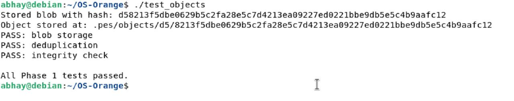

## Screenshot 1B — `find .pes/objects -type f`

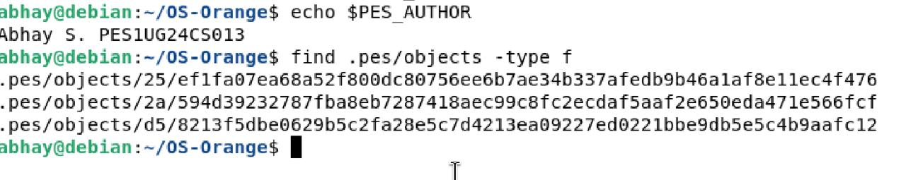

---

# Phase 2 — Tree Objects

**Files Modified:** `tree.c`

`tree_from_index()` reads `.pes/index`, converts each staged file into a `TreeEntry`, serializes the tree using `tree_serialize()`, and stores the resulting tree object using `object_write(OBJ_TREE, ...)`.

The serialized tree contains entries of the form:

```text
<mode> <name>\0<32-byte hash>
```

The entries are sorted alphabetically to ensure deterministic hashes.

## Screenshot 2A — `./test_tree`

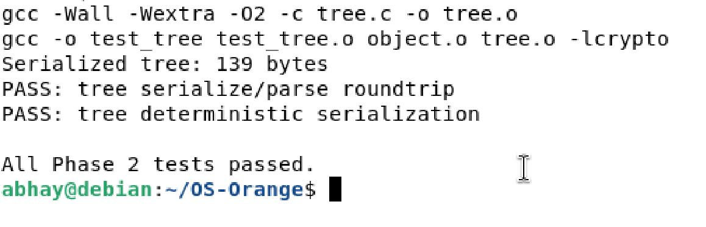

## Screenshot 2B — Raw Tree Object (`xxd`)

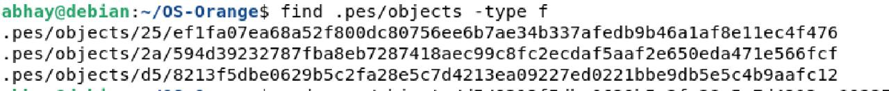

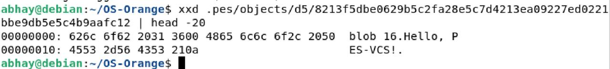

---

# Phase 3 — The Index (Staging Area)

**Files Modified:** `index.c`

`index_load()` reads `.pes/index` and parses staged entries.

`index_save()` creates a sorted copy of the index, writes to `.pes/index.tmp`, flushes and fsyncs the file, and atomically renames it to `.pes/index`.

`index_add()` reads the target file, stores it as a blob object, updates or inserts an index entry, and saves the index.

## Screenshot 3A — `pes init → pes add → pes status`

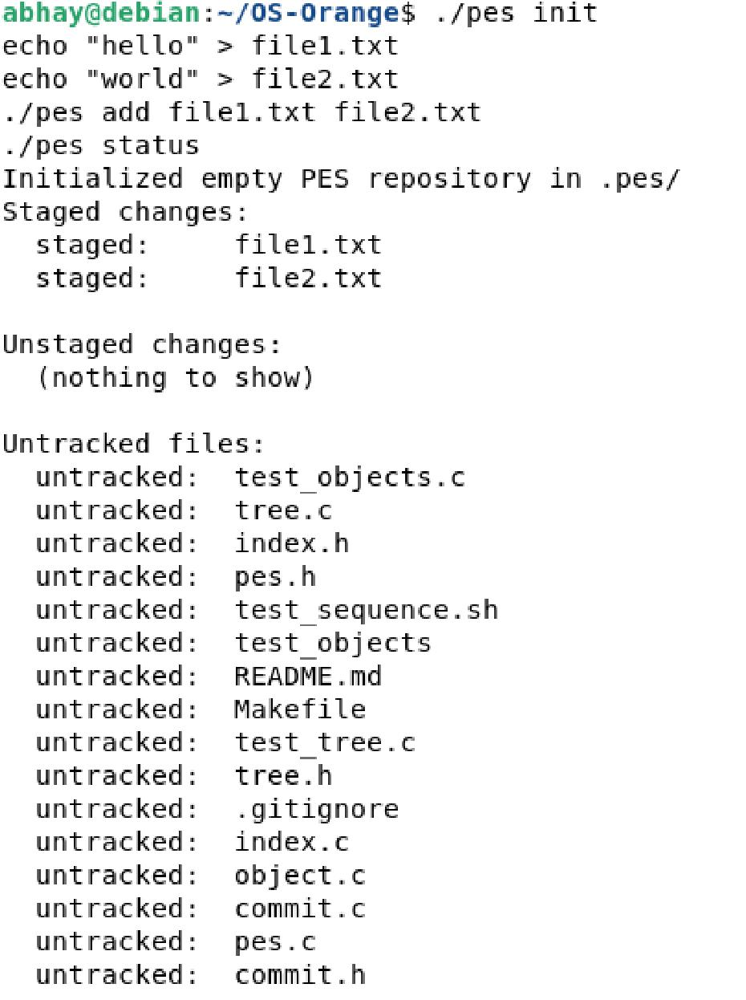

## Screenshot 3B — `cat .pes/index`

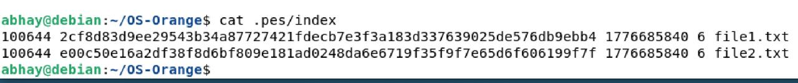

---

# Phase 4 — Commits and History

**Files Modified:** `commit.c`

`commit_create()` performs the following steps:

1. Calls `tree_from_index()` to create a tree object from the staged files.
2. Reads the current `HEAD` commit to determine the parent commit.
3. Stores the author name from `PES_AUTHOR`.
4. Stores the current Unix timestamp.
5. Serializes the commit object.
6. Writes the commit object to the object store.
7. Updates `HEAD` to point to the new commit.

## Screenshot 4A — `./pes log`

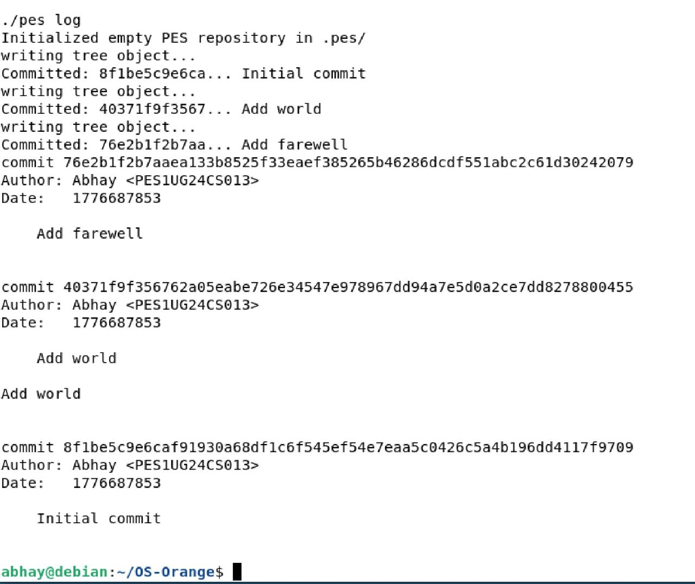

## Screenshot 4B — `find .pes -type f | sort`

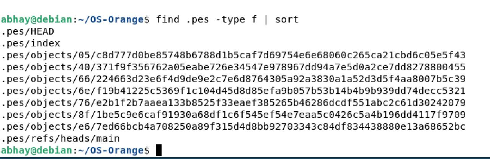

## Screenshot 4C — `cat .pes/refs/heads/main` and `cat .pes/HEAD`

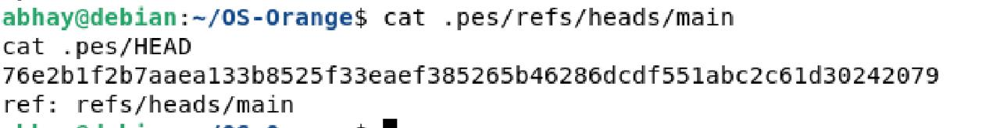

---

# Final Integration Test

## Screenshot — `bash test_sequence.sh`

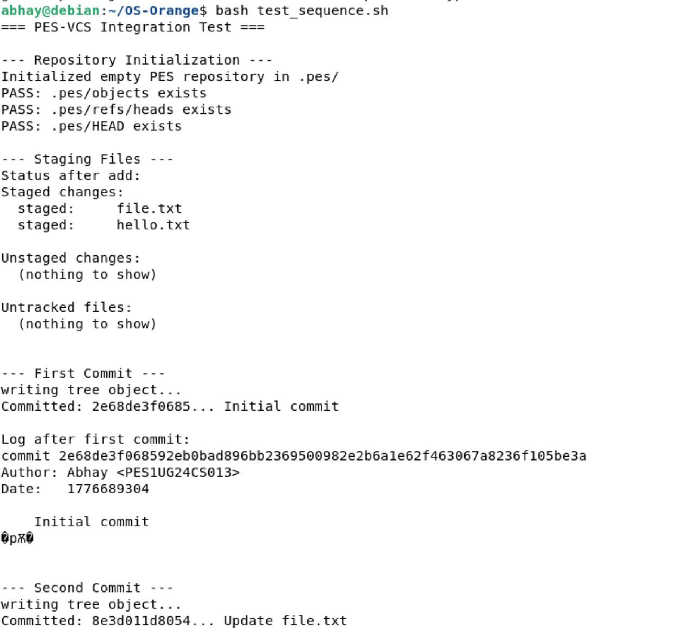
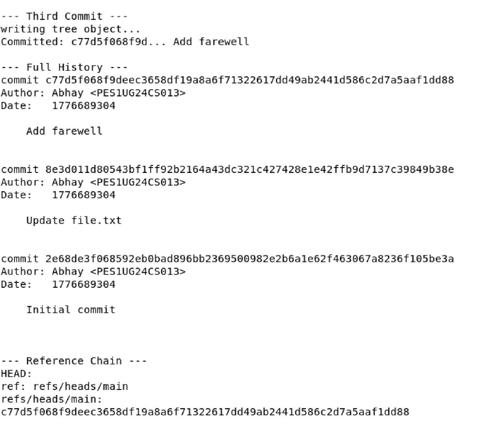
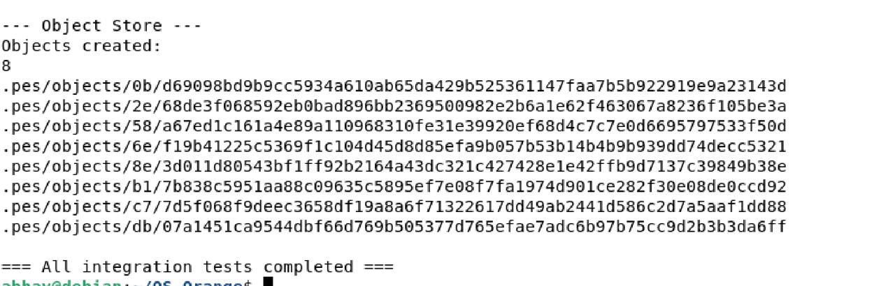

---

# Phase 5 & 6 Analysis Answers

## Q5.1 — How would `pes checkout <branch>` work?

A branch is stored as a file in:

```text
.pes/refs/heads/<branch>
```

The file contains the commit hash of the latest commit on that branch.

To implement:

```text
pes checkout feature
```

we would:

1. Read `.pes/refs/heads/feature` to get the target commit hash.
2. Read the commit object from `.pes/objects/...`.
3. Read the root tree from that commit.
4. Recursively rebuild the working directory from the tree.
5. Update `.pes/index` to match the checked-out commit.
6. Update `.pes/HEAD` from:

```text
ref: refs/heads/main
```

to:

```text
ref: refs/heads/feature
```

This operation is complex because:

* Files removed in the new branch must be deleted.
* Files changed between branches must be overwritten.
* New files must be created.
* Uncommitted user changes must not be lost.

---

## Q5.2 — How would you detect a dirty working directory conflict?

For every tracked file in `.pes/index`:

1. Read the file from the working directory.
2. Compute its blob hash.
3. Compare it with the hash stored in the index.

If the hashes differ, the file has uncommitted changes.

Then compare that file with the version in the target branch:

* If the target branch has the same version, checkout is safe.
* If the target branch also changed the file, checkout must refuse.

Example:

```text
working directory hash != index hash
AND
target branch hash != current branch hash
```

Then checkout should print:

```text
error: local changes would be overwritten
```

---

## Q5.3 — What happens in detached HEAD state?

Normally:

```text
HEAD -> refs/heads/main -> latest commit
```

In detached HEAD state:

```text
HEAD -> commit hash directly
```

Commits still work, but no branch is updated. The new commits become reachable only from `HEAD`.

Example:

```text
main -> C3
HEAD -> C5 -> C4 -> C3
```

If the user switches branches later, these commits may become unreachable.

They can be recovered by creating a branch:

```text
git branch recovered <commit-hash>
```

---

## Q6.1 — How would garbage collection work?

Algorithm:

1. Start from every branch in `.pes/refs/heads/`.
2. Mark each referenced commit as reachable.
3. Recursively follow:

   * parent commits
   * trees
   * blobs
4. Store all reachable hashes in a hash set.
5. Scan `.pes/objects/`.
6. Delete any object whose hash is not in the reachable set.

A hash set is efficient because insert and lookup are both O(1).

For a repository with 100,000 commits and 50 branches, many branches share history, so we would usually visit roughly:

* 100,000 commit objects
* 100,000 tree objects
* many blob objects

So total visited objects may be a few hundred thousand to a few million.

---

## Q6.2 — Why is concurrent garbage collection dangerous?

Race condition:

1. A commit operation writes a new blob.
2. It writes a new tree referencing that blob.
3. Before the commit object and branch reference are written, GC runs.
4. GC sees that the new blob and tree are not reachable.
5. GC deletes them.
6. The commit operation then creates a commit pointing to the deleted tree.

The repository now contains a broken commit.

Real Git avoids this by:

* Using temporary files and atomic rename.
* Using lock files while updating references.
* Avoiding deletion of very recent objects.
* Running GC only when no other Git operation is active.

